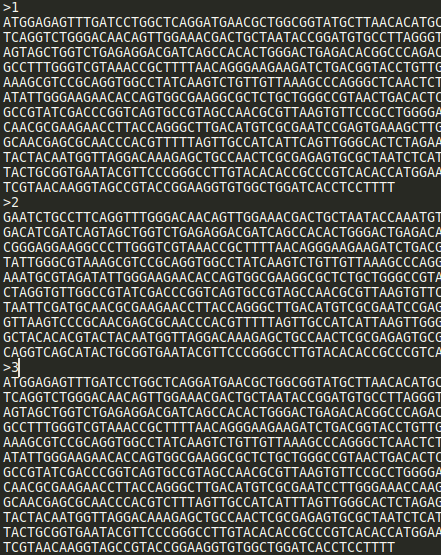
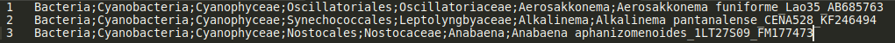

# PIMBA v3.0 in Snakemake - User Guide

Authors: Tiago Ferreira Leão, Renato R. M. Oliveira

Document Version: 1.3

Date: 23/05/2025

## Description

PIMBA (Pipeline for MetaBarcoding Analysis) (Oliveira et al. 2021) is a tool for metabarcoding analysis that allows users to create their own database, overcoming limitations of other similar tools. PIMBA adapts the Qiime/BMP pipeline (Bolyen et al. 2019)(Pylro et al. 2014) for OTU clustering and includes optional OTU corrections using the LULU algorithm (Frøslev et al. 2017). It supports paired and unpaired reads (with single or double indexing options) and enables ASV inference using Swarm (Mahé et al. 2021). PIMBA provides preliminary abundance and diversity analyses automatically. This pipeline is written in Snakemake (Köster and Rahmann 2012), a workflow management system designed to streamline the execution of complex data analysis pipelines, offering significant advantages over traditional bash scripts. Snakemake provides a structured and modular approach that enhances the readability and manageability of the pipeline. This guide will help you install and run PIMBA using Snakemake.

## How to Cite?

The peer-reviewed version of the paper can be found at https://doi.org/10.1007/978-3-030-91814-9_10

~~~
OLIVEIRA, R. R. M. et al. PIMBA: A PIpeline for MetaBarcoding Analysis. Advances in Bioinformatics and Computational Biology. 1ed. Switzerland: Springer, 2021, v. 13063, p. 106–116, 2021.
~~~

~~~
OLIVEIRA, RENATO RENISON MOREIRA; SILVA, R. L. ; NUNES, GISELE LOPES ; OLIVEIRA, GUILHERME .PIMBA: a PIpeline for MetaBarcoding Analysis. In: Stadler P.F., Walter M.E.M.T., Hernandez-Rosales M., Brigido M.M.. (Org.).Advances in Bioinformatics and Computational Biology. 1ed. Switzerland: Springer, 2021, v. 13063, p. 106-116
~~~

## Prerequisites

Before installing the software, make sure you have the following:

- A Linux-based operating system (e.g., Ubuntu, CentOS, Fedora) or Windows WSL (Windows Subsystem for Linux)
- Python (version 3.5 or later) installed on your system
- Git

## Installation

### A) Anaconda

To run Snakemake, you need to install Anaconda by following these steps:

1. Download the installation file from here: https://www.anaconda.com/download/;
2. In the terminal, navigate to the directory where the installation file is located, and run:

`bash <filename>-latest-Linux-x86_64.sh`

For example:

`bash Anaconda3-2024.10.1-latest-Linux-x86_64.sh`

3. Follow the instructions on the installer screens. If you are unsure about any settings, accept the defaults. You can change them later;
4. To apply the changes, close and reopen the terminal window;
5. Test your installation. In the terminal window, run the command `conda list`. A list of installed packages will appear if the installation was successful.

### B) Snakemake

You also need to create a new conda environment and install Snakemake and Singularity by following these steps:

`conda create -n pimba -c bioconda -c conda-forge singularity=3.8.6 snakemake=7.32.4`

`conda activate pimba`

### C) Clone the GitHub Repository

Finally, you need to clone the GitHub repository containing the code to run PIMBA in Snakemake. Use the following command:

`git clone https://github.com/itvgenomics/pimba_smk.git`

`cd pimba_smk`

You should observe the following files within the cloned directory:
- Config: Directory containing the file config.yaml where all analysis parameters will be configured. For a standard user, this is the only file that needs to be modified (more instructions on how to modify it will follow);
- Resources: Directory with resources needed to run PIMBA, such as the adapters.txt file containing adapter sequences;
- Workflow: Directory with Snakemake scripts to run PIMBA;
- Test_data: Directory with data to test the algorithm;
- README.md: User guide similar to this document;
- pimba_smk_main.sh: Main script to run PIMBA after correctly editing the config.yaml file.

## How to Run PIMBA v3.0 in Snakemake?

### A) Configure the config.yaml File

The config.yaml file (inside the config folder) is the general configuration file. It should contain parameters such as the maximum number of processors, adapter sequences, input file paths, etc. Open the file in a text editor and make the following modifications. **Note: Use full paths; partial paths will not work in this version.**

#### General options for all modes

| Parameter | Description |
| ----------- | ----------- |
| num_threads | The num_threads option indicates the maximum number of processors to be used for tasks that allow parallelization. |
| sif_dir | Directory to build all singularity image files used in the pipeline. If the path already contains the images, they will not be pulled. |

#### General options for the Prepare Mode
If the user wishes to run the "prepare" mode to prepare the reads for the "run" mode, edit the following options:

| Parameter | Description |
| ----------- | ----------- |
| minlength | The minimum length of a read after quality filtering. |
| minphred | The minimum PHRED score for quality filtering. |
| outputprepare | The name of the output file to be created in FASTA format. The ".fasta" extension is included automatically. |

#### Inputs to run paired-end reads
If the user wishes to run PIMBA for paired-end reads, it is necessary to configure:

| Parameter | Description |
| ----------- | ----------- |
| rawdatadir | The path to the directory where the reads are located. |
| adapters | The path to the adapter file within the resources directory. |
| minoverlap | Minimum overlap to merge paired reads. Default is 10 bases. |
| minsim |  Minimum similarity to merge paired reads (only for OverlapPER). Default is 0.9 (90%) similarity. |
| merger | Select the paired read merger between "pear" (PEAR) and "overlapper" (OverlapPER). |

#### Inputs for single end and single index reads
If the user has unpaired reads containing a single index, the following options need to be configured:

| Parameter | Description |
| ----------- | ----------- |
| raw_fastq | Input FASTQ file. |
| prefix | Name to be included as a prefix for the files to be generated. |
| barcodes_5end_txt | Path to the barcode file used as an index at the 5' end of the reads. |
| singleadapter | Adapter sequence found in the reads. |
| barcodes_5end_fasta | Path to the FASTA file for the barcodes_5end_txt. |

#### Inputs for single end and dual index reads
If the user has unpaired reads and a dual index, the following options need to be configured:

| Parameter | Description |
| ----------- | ----------- |
|raw_fastq | Input FASTQ file. |
| barcodes_3end_txt | Path to the barcode file used as an index at the 3' end of the reads. |
| barcodes_3end_rev | Path to the reverse complement of the barcodes_3end_txt. |
| barcodes_3end_fasta | Path to the FASTA file for the barcodes_3end_txt. |
| barcodes_5end_dir | Path to the directory containing all the barcodes.fasta and barcodes.txt files used at the 5' end of the reads. Each 3' barcode should have a corresponding FASTA and TXT file with all the associated 5' barcodes. |
| forward_adapter | Forward primer sequence. |
| reverse_adapter | Reverse primer sequence. |

#### Inputs for the Run Mode
After configuring the "prepare" mode according to the type of read being used, configure the inputs for the "run" mode according to the parameters below.

| Parameter | Description |
| ----------- | ----------- |
| outputrun            | Name of the output folder to be generated.                                                        |
| strategy             | Analysis strategy to be used. Can be "otu" or "asv". If "otu", PIMBA uses vsearch. If "asv", swarm is used. |
| otu_similarity       | Percentage of similarity used in OTU clustering. The default is 0.97.                            |
| assign_similarity    | Percentage of similarity used in taxonomy assignment. The default is 0.9.                       |
| mincoverage          | Minimum coverage for alignment. The default is 0.9.                                              |
| otu_length           | Minimum length for trimming reads. If the value is 0, no reads will be trimmed.                 |
| hits_per_subject     | If 1, choose the best hit. If > 1, choose by majority. The default is 1.                        |
| marker_gene          | Marker gene and database for the analysis. Can be: 16S-SILVA, 16S-GREENGENES, 16S-RDP, 16S-NCBI, COI-NCBI, COI-BOLD, ITS-PLANTS-NCBI, ITS-FUNGI-UNITE, ITS-FUNGI-NCBI, or ALL-NCBI. |
| e_value              | Expected value (e-value) used by BLAST. The default is 0.001.                                  |
| lulu                 | If set to 'yes', PIMBA will discard erroneous OTUs or ASVs using LULU. The default is 'no' (not using LULU). |
| ITS                  | Set to 'yes' if the reads are ITS.                                                               |
| remote | Define whether BLAST will be done in remote mode (without having to download the database) or in local mode. |
| db_type | Define the NCBI BLAST database, for example, nt, core_nt and so on. |
| create_excel | If set to 'yes', PIMBA will create an excel sheet for manual curation, flagging inconsistent OTUs/ASVs. The default is 'yes' |

#### Database paths
Depending on the database used, provide the full path to the files related to that database. Snakemake will only use the path specified in the "marker_gene" option from the previous item, so only the specified marker gene needs to be configured. Additionally, for runs including the NCBI database, the taxdump folder needs to be downloaded and the full path needs to be included in the config file. Use the following commands to download and uncompress the taxdump folder:

`wget ftp://ftp.ncbi.nlm.nih.gov/pub/taxonomy/new_taxdump/new_taxdump.tar.gz`

`tar -xzvf new_taxdump.tar.gz`

The links for downloading the databases can be found here:

- SILVA for 16S: https://www.arb-silva.de/no_cache/download/archive/qiime/
- Greengenes for 16S: ftp://greengenes.microbio.me/greengenes_release/gg_13_5/gg_13_8_otus.tar.gz
- RDP for 16S: https://sourceforge.net/projects/rdp-classifier/files/RDP_Classifier_TrainingData/RDPClassifier_16S_trainsetNo18_QiimeFormat.zip/download
- UNITE for fungal ITS: https://doi.plutof.ut.ee/doi/10.15156/BIO/2959330
- BOLD for COI: https://1drv.ms/u/c/21dad68eb08355ae/Qa5Vg7CO1toggCFAXAEAAAAAzFZG1bUqP8R1ag

#### Inputs for the Plot Mode
This section refers to generating plots for the processed results. To run PIMBA Plot, configure:

| Parameter | Description |
| ----------- | ----------- |
| metadata | The path to the metadata file. |
| group_by | Set "group_by" with the metadata parameter to group the samples (use "False" for not grouping the samples). |

#### Inputs for the Place Mode
This section is optional and refers to generating a tree with unclassified OTUs placed in this reference tree. To run PIMBA Place, configure the config_place.yaml with these parameters (the remaining parameters can be left as default):

| Parameter | Description |
| ----------- | ----------- |
| samples | List of input FASTA files (unclassified OTUs to be placed). It can be a single file or a list with several files, using -"" to list each one of the files. |
| reference-tree | Reference tree in newick format. |
| reference-alignment | Reference alignment in FASTA format. Needs to contain the same sequences (by name) as the reference tree. |
| taxonomy-file | File containing a tab-separated list of reference taxon with full taxonomic string assignments to the names in the reference tree file (see example below). |
| datatype | Type of data, 'nt' for DNA, 'aa' for protein. |

~~~
EF635241.1_Pseudoalteromonas_sp._BSw20683	Bacteria;Pseudomonadati;Pseudomonadota;Gammaproteobacteria;Alteromonadales;Pseudoalteromonadaceae;Pseudoalteromonas;unclassifiedPseudoalteromonas
MT634734.1_Pseudoalteromonas_sp._strain_GAMAL14_SWC	Bacteria;Pseudomonadati;Pseudomonadota;Gammaproteobacteria;Alteromonadales;Pseudoalteromonadaceae;Pseudoalteromonas;unclassifiedPseudoalteromonas
MT634729.1_Pseudoalteromonas_sp._strain_GAMAL3_SWC	Bacteria;Pseudomonadati;Pseudomonadota;Gammaproteobacteria;Alteromonadales;Pseudoalteromonadaceae;Pseudoalteromonas;unclassifiedPseudoalteromonas
...
~~~

The output ".jplace" file containing the tree with the OTUs placed can be found at `/results/03-placed/no_clustering/placed/` and it can be visualized using iTOL (https://itol.embl.de/).

### B) Run the "pimba_smk_main.sh" file
The "pimba_smk_main.sh" file is the main bash script that runs all the steps of the pipeline in Snakemake. This file takes the following parameters as input:

- "-p": PIMBA preparation mode; choose between "paired_end", "single_index", "dual_index", or "no".
- "-r": PIMBA execution mode; specify the name of the marker gene (and consequently the database) to be used, choosing from 16S-SILVA, 16S-GREENGENES, 16S-RDP, 16S-NCBI, ITS-FUNGI-NCBI, ITS-FUNGI-UNITE, ITS-PLANTS-NCBI, or COI-NCBI. For a custom database, include the path to the directory where the database is stored instead of the marker gene. To skip, indicate "no".
- "-g": PIMBA plotting mode; choose between "yes" or "no".
- "-l": PIMBA Place mode (for phylogenetic placement of unclassified OTUs); choose between "yes" or "no".
- "-t": number of processors.
- "-c": the path to the config file.
- "-d": the path to the working directory.

#### Example of testing: 
Use the data in the "test_data" folder to test the algorithm by running it. First, modify the correct paths in the config file (including the path to the BOLD database), and then run the following command:

`bash pimba_smk_main.sh -p paired_end -r COI-BOLD -g yes -l no -t 8 -c config/config.yaml -d .`

#### Unlocking the working directory
If the execution of the Snakemake is interrupted, the working directory will be locked. To unlock it, run the code with the flag `-u` as in this example below and then run it again without the flag.

`bash pimba_smk_main.sh -p paired_end -r COI-BOLD -g yes -l no -t 8 -c config/config.yaml -d . -u`

## Configure your personalized database
Suppose you want to use a personalized database. In that case, you will only need a fasta file with the reference sequences and their identification, and a two-column tax.txt file with the sequence ID and the full taxonomy written for every reference sequence in the fasta file. Put them in the same directory, e.g.: /path/to/your/database/. 

Example of the FASTA file:

Example of the taxonomy file:

Then, install blastn on your computer and run makeblastdb in your fasta file:

`conda install bioconda::blast`

`makeblastdb -in <your_fasta.fasta> -dbtype nucl -parse_seqids`

After that, you need is to set the /path/to/your/database/ in the config variable `marker_gene` and run the bash script like this example:

`bash pimba_smk_main.sh -p paired_end -r /path/to/your/database/ -g yes -l no -t 8 -c config/config.yaml -d .`

## Manual curation

This mode is optional but recommended. If create_excel is set to 'yes' in the config.yaml file, PIMBA will create an excel sheet to flag inconsistent OTU/ASV records. Instructions for manual curation can be found in the `manual_curation_guide.pdf`.

## References

1. Bolyen, Evan, Jai Ram Rideout, Matthew R. Dillon, Nicholas A. Bokulich, Christian C. Abnet, Gabriel A. Al-Ghalith, Harriet Alexander, et al. 2019. “Reproducible, Interactive, Scalable and Extensible Microbiome Data Science Using QIIME 2.” Nature Biotechnology 37 (8): 852–57.
2. Frøslev, Tobias Guldberg, Rasmus Kjøller, Hans Henrik Bruun, Rasmus Ejrnæs, Ane Kirstine Brunbjerg, Carlotta Pietroni, and Anders Johannes Hansen. 2017. “Algorithm for Post-Clustering Curation of DNA Amplicon Data Yields Reliable Biodiversity Estimates.” Nature Communications 8 (1): 1188.
3. Köster, Johannes, and Sven Rahmann. 2012. “Snakemake--a Scalable Bioinformatics Workflow Engine.” Bioinformatics (Oxford, England) 28 (19): 2520–22.
4. Mahé, Frédéric, Lucas Czech, Alexandros Stamatakis, Christopher Quince, Colomban de Vargas, Micah Dunthorn, and Torbjørn Rognes. 2021. “Swarm v3: Towards Tera-Scale Amplicon Clustering.” Bioinformatics (Oxford, England) 38 (1): 267–69.
5. Oliveira, Renato R. M., Raíssa Silva, Gisele L. Nunes, and Guilherme Oliveira. 2021. “PIMBA: A PIpeline for MetaBarcoding Analysis.” Advances in Bioinformatics and Computational Biology, 106–16.
6. Pylro, Victor S., Luiz Fernando W. Roesch, Daniel K. Morais, Ian M. Clark, Penny R. Hirsch, and Marcos R. Tótola. 2014. “Data Analysis for 16S Microbial Profiling from Different Benchtop Sequencing Platforms.” Journal of Microbiological Methods 107 (December):30–37.
