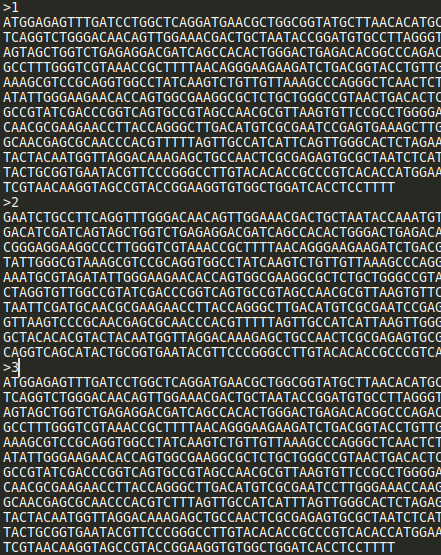
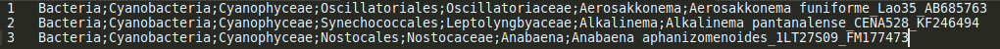

<h1 align="center">PIMBA v3.0 in Snakemake - User Guide</h1>

<p align="center">
<strong>Version:</strong> 1.3 &nbsp;|&nbsp;
<strong>Last updated:</strong> July 2026
</p>

<p align="center">
  
</p>

---

## Authors

**Tiago Ferreira Leão** - [ResearchGate](https://www.researchgate.net/profile/Tiago-Leao-3) | [LinkedIn](https://linkedin.com/in/tiago-leão-69565a4a) | <tiago.leao@pq.itv.org>

**Fabricio dos Anjos Santa Rosa** - [ResearchGate](https://www.researchgate.net/profile/Fabricio-Rosa) | [LinkedIn](https://linkedin.com/in/fabricio-dos-anjos-santa-rosa-b3a9771b9) | <fabricio.rosa@pq.itv.org>

**Renato R. M. Oliveira** - [ResearchGate](https://www.researchgate.net/profile/Renato-Oliveira-17) | [LinkedIn](https://linkedin.com/in/reinator) | <Renato.Oliveira8@itv.org>

---

## Table of Contents

1. [Introduction](#1-introduction)
   
   1.1. [Overview](#11-overview)

   1.2. [Description](#12-description)

   1.3. [How to Cite?](#13-how-to-cite)

2. [Installation](#2-installation)

   2.1. [Prerequisites](#21-prerequisites)

   2.2. [Anaconda](#22-anaconda)

   2.3. [Snakemake](#23-snakemake)

   2.4. [Clone the GitHub Repository](#24-clone-the-github-repository)

3. [PIMBA 3.0 - Main Workflow](#3-pimba-30---main-workflow)

   3.1. [Configuration](#31-configuration)

   &nbsp;&nbsp;&nbsp;&nbsp;3.1.1. [General options](#311-general-options)

   &nbsp;&nbsp;&nbsp;&nbsp;3.1.2. [Prepare Mode](#312-prepare-mode)

   &nbsp;&nbsp;&nbsp;&nbsp;&nbsp;&nbsp;&nbsp;&nbsp;3.1.2.1. [Paired-end reads](#3121-paired-end-reads)

   &nbsp;&nbsp;&nbsp;&nbsp;&nbsp;&nbsp;&nbsp;&nbsp;3.1.2.2. [Single-end and single-index reads](#3122-single-end-and-single-index-reads)

   &nbsp;&nbsp;&nbsp;&nbsp;&nbsp;&nbsp;&nbsp;&nbsp;3.1.2.3. [Single-end and dual-index reads](#3123-single-end-and-dual-index-reads)

   &nbsp;&nbsp;&nbsp;&nbsp;3.1.3. [Run Mode](#313-run-mode)

   &nbsp;&nbsp;&nbsp;&nbsp;3.1.4. [Database paths](#314-database-paths)

   &nbsp;&nbsp;&nbsp;&nbsp;3.1.5. [Plot Mode](#315-plot-mode)

   &nbsp;&nbsp;&nbsp;&nbsp;3.1.6. [Place Mode](#316-place-mode)

   3.2. [Running the workflow](#32-running-the-workflow)

   &nbsp;&nbsp;&nbsp;&nbsp;3.2.1. [Example](#321-example)

   &nbsp;&nbsp;&nbsp;&nbsp;3.2.2. [Unlocking the working directory](#322-unlocking-the-working-directory)

   3.3. [Custom databases](#33-custom-databases)

4. [PIMBA Tax](#4-pimba-tax)

5. [PIMBA Curate](#5-pimba-curate)

   5.1. [Supported databases](#51-supported-databases)

   5.2. [Configuration](#52-configuration)

   5.3. [Running PIMBA Curate](#53-running-pimba-curate)

   5.4. [Outputs](#54-outputs)

   5.5. [Validation categories](#55-validation-categories)

   5.6. [Workflow](#56-workflow)

6. [References](#6-references)

---

# 1. Introduction

## 1.1. Overview

<p align="justify"><strong>PIMBA</strong> (<strong>PI</strong>peline for <strong>M</strong>eta<strong>B</strong>arcoding <strong>A</strong>nalysis) is an open-source Snakemake workflow for DNA metabarcoding analyses. The pipeline supports both OTU- and ASV-based strategies, multiple reference databases, custom reference libraries, and automated downstream analyses within a modular and reproducible workflow.</p>

PIMBA v3.0 is organized into three independent modules:

- <p align="justify"><strong>PIMBA Main Workflow</strong> — complete metabarcoding analysis workflow, including read preprocessing (<strong>Prepare</strong>), OTU/ASV inference and taxonomic assignment (<strong>Run</strong>), downstream visualization (<strong>Plot</strong>), and phylogenetic placement of unclassified sequences (<strong>Place</strong>).</p>
- **PIMBA Tax** — taxonomic reassignment of existing OTU/ASV datasets using alternative reference databases while preserving sequence identities.
- **PIMBA Curate** — automated taxonomic curation, standardization, and validation of BLAST-based taxonomic assignments.


This guide describes the installation, configuration and execution of all modules available in the PIMBA v3.0 Snakemake workflow.

## 1.2. Description

<p align="justify">PIMBA (Pipeline for MetaBarcoding Analysis) (Oliveira et al. 2021) is a tool for metabarcoding analysis that allows users to create their own database, overcoming limitations of other similar tools. PIMBA adapts the Qiime/BMP pipeline (Bolyen et al. 2019)(Pylro et al. 2014) for OTU clustering and includes optional OTU corrections using the LULU algorithm (Frøslev et al. 2017). It supports paired and unpaired reads (with single or double indexing options) and enables ASV inference using Swarm (Mahé et al. 2021). PIMBA provides preliminary abundance and diversity analyses automatically. This pipeline is written in Snakemake (Köster and Rahmann 2012), a workflow management system designed to streamline the execution of complex data analysis pipelines, offering significant advantages over traditional bash scripts. Snakemake provides a structured and modular approach that enhances the readability and manageability of the pipeline. This guide will help you install and run PIMBA using Snakemake.</p>

## 1.3. How to Cite?

The peer-reviewed publication describing PIMBA is available in [**Oliveira et al. (2021)**](https://doi.org/10.1007/978-3-030-91814-9_10).

~~~
OLIVEIRA, R. R. M. et al. PIMBA: A PIpeline for MetaBarcoding Analysis. Advances in Bioinformatics and Computational Biology. 1ed. Switzerland: Springer, 2021, v. 13063, p. 106–116, 2021.
~~~

~~~
OLIVEIRA, RENATO RENISON MOREIRA; SILVA, R. L. ; NUNES, GISELE LOPES ; OLIVEIRA, GUILHERME .PIMBA: a PIpeline for MetaBarcoding Analysis. In: Stadler P.F., Walter M.E.M.T., Hernandez-Rosales M., Brigido M.M.. (Org.).Advances in Bioinformatics and Computational Biology. 1ed. Switzerland: Springer, 2021, v. 13063, p. 106-116
~~~

---

# 2. Installation

## 2.1. Prerequisites

Before installing the software, make sure you have the following:

- A Linux-based operating system (e.g., Ubuntu, CentOS, Fedora) or Windows WSL (Windows Subsystem for Linux);
- Python (version 3.5 or later) installed on your system;
- Git.

## 2.2. Anaconda

To run Snakemake, you need to install Anaconda by following these steps:

1. Download the latest **Anaconda** installer from the [official download page](https://www.anaconda.com/download/);
2. In the terminal, navigate to the directory where the installation file is located, and run:

```bash
bash <filename>-latest-Linux-x86_64.sh
```

For example:

```bash
bash Anaconda3-2024.10.1-latest-Linux-x86_64.sh
```

3. Follow the instructions on the installer screens. If you are unsure about any settings, accept the defaults. You can change them later;
4. To apply the changes, close and reopen the terminal window;
5. Test your installation. In the terminal window, run the command `conda list`. A list of installed packages will appear if the installation was successful.

## 2.3. Snakemake

You also need to create a new conda environment and install Snakemake and Singularity by following these steps:

```bash
conda create -n pimba -c bioconda -c conda-forge singularity=3.8.6 snakemake=7.32.4
```

```bash
conda activate pimba
```

## 2.4. Clone the GitHub Repository

Clone the PIMBA Snakemake repository:

```bash
git clone https://github.com/itvgenomics/pimba_smk.git
```

Move into the project directory:

```bash
cd pimba_smk
```

You should observe the following files within the cloned directory:
- <p align="justify">Config: Directory containing the file config.yaml where all analysis parameters will be configured. For a standard user, this is the only file that needs to be modified (more instructions on how to modify it will follow);</p>

- Resources: Directory with resources needed to run PIMBA, such as the adapters.txt file containing adapter sequences;
- Workflow: Directory with Snakemake scripts to run PIMBA;
- Test_data: Directory with data to test the algorithm;
- README.md: User guide similar to this document;
- pimba_smk_main.sh: Main script to run PIMBA after correctly editing the config.yaml file.

---

# 3. PIMBA 3.0 - Main Workflow

## 3.1. Configuration

<p align="justify">The <code>config.yaml</code> file (located in the <code>config</code> directory) is the main configuration file for the PIMBA Main Workflow. It contains the parameters required to execute the pipeline, including the number of processors, adapter sequences, input file paths, and other workflow settings. Open the file in a text editor and modify the parameters as needed. <strong>Note:</strong> Always use absolute (full) paths, as relative paths are not supported in the current version.</p>

### 3.1.1. General options

| Parameter | Description |
| --------- | ----------- |
| `num_threads` |  <p align="justify">The `num_threads` option indicates the maximum number of processors to be used for tasks that allow parallelization.</p> |
| `sif_dir` |  <p align="justify">Directory used to store the Singularity image files required by the pipeline. If the images are already present, they will not be downloaded again.</p> |

### 3.1.2. Prepare Mode
If the user wishes to run the "prepare" mode to prepare the reads for the "run" mode, edit the following options:

| Parameter | Description |
| --------- | ----------- |
| `minlength` | The minimum length of a read after quality filtering. |
| `minphred` | The minimum PHRED score for quality filtering. |
| `outputprepare` |  <p align="justify">The name of the output file to be created in FASTA format. The `.fasta` extension is included automatically.</p> |

#### 3.1.2.1. Paired-end reads
If the user wishes to run PIMBA for paired-end reads, it is necessary to configure:

| Parameter | Description |
| --------- | ----------- |
| `rawdatadir` | The path to the directory where the reads are located. |
| `adapters` | The path to the adapter file within the resources directory. |
| `minoverlap` | Minimum overlap to merge paired reads. Default is 10 bases. |
| `minsim` | Minimum similarity to merge paired reads (only for OverlapPER). Default is 0.9 (90%) similarity. |
| `merger` | Select the paired read merger between `"pear"` (PEAR) and `"overlapper"` (OverlapPER). |

#### 3.1.2.2. Single-end and single-index reads
If the user has unpaired reads containing a single index, the following options need to be configured:

| Parameter | Description |
| --------- | ----------- |
| `raw_fastq` | Input FASTQ file. |
| `prefix` | Name to be included as a prefix for the files to be generated. |
| `barcodes_5end_txt` | Path to the barcode file used as an index at the 5' end of the reads. |
| `singleadapter` | Adapter sequence found in the reads. |
| `barcodes_5end_fasta` | Path to the FASTA file for the `barcodes_5end_txt`. |

#### 3.1.2.3. Single-end and dual-index reads
If the user has unpaired reads and a dual index, the following options need to be configured:

| Parameter | Description |
| --------- | ----------- |
| `raw_fastq` | Input FASTQ file. |
| `barcodes_3end_txt` | Path to the barcode file used as an index at the 3' end of the reads. |
| `barcodes_3end_rev` | Path to the reverse complement of the `barcodes_3end_txt`. |
| `barcodes_3end_fasta` | Path to the FASTA file for the `barcodes_3end_txt`. |
| `barcodes_5end_dir` | <p align="justify">Path to the directory containing all the `barcodes.fasta` and `barcodes.txt` files used at the 5' end of the reads. Each 3' barcode should have a corresponding FASTA and TXT file with all the associated 5' barcodes.</p> |
| `forward_adapter` | Forward primer sequence. |
| `reverse_adapter` | Reverse primer sequence. |

### 3.1.3. Run Mode
After configuring the "prepare" mode according to the type of read being used, configure the inputs for the "run" mode according to the parameters below.

| Parameter | Description |
| --------- | ----------- |
| `outputrun` | Name of the output folder to be generated. |
| `strategy` | <p align="justify">Analysis strategy to be used. Can be "otu" or "asv". If "otu", PIMBA uses vsearch. If "asv", swarm is used.</p> |
| `otu_similarity` | Percentage of similarity used in OTU clustering. The default is 0.97. |
| `assign_similarity` | Percentage of similarity used in taxonomy assignment. The default is 0.9. |
| `mincoverage` | Minimum coverage for alignment. The default is 0.9. |
| `otu_length` | Minimum length for trimming reads. If the value is 0, no reads will be trimmed. |
| `hits_per_subject` | If 1, choose the best hit. If > 1, choose by majority. The default is 1. |
| `marker_gene` | <p align="justify">Marker gene and database for the analysis. Can be: 16S-SILVA, 16S-GREENGENES, 16S-RDP, 16S-NCBI, COI-NCBI, COI-BOLD, ITS-PLANTS-NCBI, ITS-FUNGI-UNITE, ITS-FUNGI-NCBI, or ALL-NCBI.</p> |
| `e_value` | Expected value (e-value) used by BLAST. The default is 0.001. |
| `lulu` | <p align="justify">If set to 'yes', PIMBA will discard erroneous OTUs or ASVs using LULU. The default is 'no' (not using LULU).</p> |
| `ITS` | Set to 'yes' if the reads are ITS. |
| `remote` | Define whether BLAST will be done in remote mode (without having to download the database) or in local mode. |
| `db_type` | Define the NCBI BLAST database, for example, nt, core_nt and so on. |
| `create_excel` | <p align="justify">If set to 'yes', PIMBA will create an excel sheet for manual curation, flagging inconsistent OTUs/ASVs. The default is 'yes'.</p> |
| `blast_type` | Define the type of BLAST to be used, default is megablast. Blastn-short is another option. |

### 3.1.4. Database paths
<p align="justify">Provide the full path to the reference database(s) in <code>config.yaml</code>. Only the database selected through the <code>marker_gene</code> parameter will be used during the analysis. Additionally, for analyses using the NCBI database, the NCBI taxonomy dump (<code>taxdump</code>) must also be downloaded and its directory specified in the configuration file.</p>

Download the latest NCBI taxonomy dump:

```bash
wget ftp://ftp.ncbi.nlm.nih.gov/pub/taxonomy/new_taxdump/new_taxdump.tar.gz
```

Extract the downloaded archive:

```bash
tar -xzvf new_taxdump.tar.gz
```

The reference databases can be downloaded from the following sources:

- [**SILVA**](https://zenodo.org/records/17793346) for 16S (version 138.2);
- [**Greengenes**](greengenes.microbio.me/greengenes_release/gg_13_5/gg_13_8_otus.tar.gz) for 16S (version 13.8);
- [**RDP**](https://sourceforge.net/projects/rdp-classifier/files/RDP_Classifier_TrainingData/RDPClassifier_16S_trainsetNo18_QiimeFormat.zip/download) for 16S (version 18);
- [**UNITE**](https://doi.plutof.ut.ee/doi/10.15156/BIO/2959330) for fungal ITS (2024 release);
- [**BOLD**](https://zenodo.org/records/18304758) for COI (2024 release).

### 3.1.5. Plot Mode
This section refers to generating plots for the processed results. To run PIMBA Plot, configure:

| Parameter | Description |
| --------- | ----------- |
| `metadata` | Path to the sample metadata file. |
| `group_by` | Metadata column used to group samples during plotting. Set to `False` to disable sample grouping. |

### 3.1.6. Place Mode
<p align="justify">This section is optional and refers to generating a tree with unclassified OTUs placed in this reference tree. To run PIMBA Place, configure the config_place.yaml with these parameters (the remaining parameters can be left as default):</p>

| Parameter | Description |
| --------- | ----------- |
| `samples` | <p align="justify">List of input FASTA files containing unclassified OTUs/ASVs to be placed. A single file or multiple files can be provided.</p> |
| `reference-tree` | Reference phylogenetic tree in Newick format. |
| `reference-alignment` | <p align="justify">Reference sequence alignment in FASTA format. Sequence names must match those in the reference tree.</p> |
| `taxonomy-file` | <p align="justify">Tab-delimited file containing the complete taxonomic assignment for each reference sequence in the tree (see example below).</p> |
| `datatype` | <p align="justify">Sequence type: `nt` for nucleotide sequences or `aa` for amino acid sequences.</p> |

<p align="justify">The output <code>.jplace</code> file containing the phylogenetic placement of unclassified OTUs/ASVs is written to <code>/results/03-placed/no_clustering/placed/</code>. The resulting tree can be visualized interactively using <a href="https://itol.embl.de/"><strong>iTOL</strong></a>.</p>

## 3.2. Running the workflow
The <code>pimba_smk_main.sh</code> file is the main bash script that runs all the steps of the pipeline in Snakemake. This file takes the following parameters as input:

- "-p": PIMBA preparation mode; choose between "paired_end", "single_index", "dual_index", or "no".
- <p align="justify">"-r": PIMBA execution mode; specify the name of the marker gene (and consequently the database) to be used, choosing from 16S-SILVA, 16S-GREENGENES, 16S-RDP, 16S-NCBI, ITS-FUNGI-NCBI, ITS-FUNGI-UNITE, ITS-PLANTS-NCBI, or COI-NCBI. For a custom database, include the path to the directory where the database is stored instead of the marker gene. To skip, indicate "no".</p>
- "-g": PIMBA plotting mode; choose between "yes" or "no".
- "-l": PIMBA Place mode (for phylogenetic placement of unclassified OTUs); choose between "yes" or "no".
- "-t": number of processors.
- "-c": the path to the config file.
- "-d": the path to the working directory.

### 3.2.1. Example
<p align="justify">Use the files provided in the <code>test_data</code> directory to test the workflow. Before running the example, update the required paths in <code>config.yaml</code>, including the path to the BOLD reference database.</p>

```bash
bash pimba_smk_main.sh -p paired_end -r COI-BOLD -g yes -l no -t 8 -c config/config.yaml -d .
```

### 3.2.2. Unlocking the working directory
<p align="justify">If a Snakemake execution is interrupted, the working directory becomes locked. To remove the lock, rerun the command using the `-u` option and then execute the pipeline again without this flag.</p>

```bash
bash pimba_smk_main.sh -p paired_end -r COI-BOLD -g yes -l no -t 8 -c config/config.yaml -d . -u
```

## 3.3. Custom databases
<p align="justify">Suppose you want to use a personalized database. In that case, you will only need a fasta file with the reference sequences and their identification, and a two-column tax.txt file with the sequence ID and the full taxonomy written for every reference sequence in the fasta file. Put them in the same directory, e.g.: <code>/path/to/your/database/</code>.</p> 

Example of the FASTA file:
<p align="center">

</p>

Example of the taxonomy file:
<p align="center">

</p>

Then, install BLAST+:

```bash
conda install bioconda::blast
```

Next, build a local BLAST database from your FASTA file:

```bash
makeblastdb -in <your_fasta.fasta> -dbtype nucl -parse_seqids
```

<p align="justify">Finally, set the path to your custom database in the `marker_gene` parameter of `config.yaml` and run PIMBA using the database directory as the `-r` argument:</p>

```bash
bash pimba_smk_main.sh -p paired_end -r /path/to/your/database/ -g yes -l no -t 8 -c config/config.yaml -d .
```

---

# 4. PIMBA Tax

<p align="justify">This mode is recommended for reanalyzing the same OTUs/ASVs using a different database for taxonomic assignment, while preserving sequence IDs and enabling comparisons across multiple databases.</p>

To run this mode, complete the config_tax.yaml file. This configuration uses the same parameters as the PIMBA Run mode, with the addition of the following:


| Parameter | Description |
| ----------- | ----------- |
| txt_table | <p align="justify">Table containing the abundances of OTUs/ASVs. For example, the default output from PIMBA Run is located at /results/01-run/AllSamples_97clust90assign/AllSamples_otu_table.txt.</p> |
| fasta_file | <p align="justify">FASTA file containing the sequences of the OTUs/ASVs. For example, the default output from PIMBA Run is located at /results/01-run/AllSamples_97clust90assign/AllSamples_otus.fasta.</p> |
| raw_reads | <p align="justify">FASTA file containing the sequences of processed reads from PIMBA Prepare. For example, the default output from PIMBA Prepare is located at /results/00-prepare/AllSamples.fasta.</p> |

After configuring the config_tax.yaml file, run PIMBA Tax with the following command:

```bash
bash pimba_smk_tax.sh -r 16S-RDP -t 8 -c config/config_tax.yaml -d .
```

- <p align="justify">"-r": PIMBA execution mode; specify the name of the marker gene (and consequently the database) to be used, choosing from 16S-SILVA, 16S-GREENGENES, 16S-RDP, 16S-NCBI, ITS-FUNGI-NCBI, ITS-FUNGI-UNITE, ITS-PLANTS-NCBI, or COI-NCBI. For a custom database, include the path to the directory where the database is stored instead of the marker gene.</p>
- "-t": number of processors.
- "-c": the path to the config file.
- "-d": the path to the working directory.

---

# 5. PIMBA Curate

<p align="justify"><strong>PIMBA Curate</strong> is a module of <strong>PIMBA 3.0</strong> developed to standardize, validate, and curate taxonomic assignments generated after the BLAST-based identification step. The workflow integrates OTU/ASV abundance tables, representative sequences, BLAST results, and reference taxonomy databases into a standardized output suitable for downstream analyses and manual taxonomic validation.</p>

<p align="justify">The module supports both <strong>OTU</strong> and <strong>ASV</strong> workflows and automatically detects the input type from sequence identifiers. It also supports both <strong>single-hit</strong> and <strong>multi-hit</strong> taxonomic assignment modes.</p>

## 5.1. Supported databases

Database selection is controlled through the `marker_gene` parameter in the `config.yaml` file.

Built-in databases are specified as:

```yaml
marker_gene: "COI-BOLD"
marker_gene: "COI-NCBI"

marker_gene: "16S-SILVA"
marker_gene: "16S-GREENGENES"
marker_gene: "16S-RDP"
marker_gene: "16S-NCBI"

marker_gene: "ITS-FUNGI-UNITE"
marker_gene: "ITS-FUNGI-NCBI"
marker_gene: "ITS-PLANTS-NCBI"

# To search across all NCBI-supported markers
marker_gene: "ALL-NCBI"
```

Any other value is interpreted as a path to a custom reference database:

```yaml
marker_gene: "/path/to/custom_reference_directory"
```

<p align="justify">Custom databases must contain exactly one reference taxonomy file (`*.txt`) and are parsed using the same taxonomy format adopted for the BOLD database.</p>

## 5.2. Configuration

The following database paths must be defined in `config.yaml`:

```yaml
COI-BOLD-DB: "/path/to/BOLD_database"
16S-RDP-DB: "/path/to/RDP_database"
16S-GREENGENES-DB: "/path/to/Greengenes_database"
16S-SILVA-DB: "/path/to/SILVA_database"
ITS-FUNGI-UNITE-DB: "/path/to/UNITE_database"
NCBI-DB: "/path/to/NCBI_database"
taxdump: "/path/to/taxdump_database"
```

PIMBA Curate introduces the following configuration parameters:

```yaml
ncbi_taxizedb: "/path/to/local_taxizedb_cache"

mode: "single"
# or
mode: "multi"
```

<p align="justify">The <code>ncbi_taxizedb</code> parameter specifies the local SQLite database used by <strong>taxizedb</strong> during species validation and is required regardless of the selected reference database. A pre-built version of this database, prepared specifically for PIMBA Curate, is available on <a href="https://zenodo.org/records/21109830">Zenodo</a>.</p>

The `mode` parameter defines how BLAST hits are imported into the curation workflow:

- **single:** Retains only the highest-scoring BLAST hit for each sequence.
- <p align="justify"><strong>multi:</strong> Retains all recovered BLAST hits for each sequence. This option is only available when <code>hits_per_subject</code> is greater than <code>1</code> in the main PIMBA <code>config.yaml</code>.</p>

## 5.3. Running PIMBA Curate

```bash
bash pimba_smk_curate.sh -t 8 -c config/config.yaml -d .
```

Long options are also supported:

```bash
bash pimba_smk_curate.sh -threads 8 -config config/config.yaml -directory .
```

To unlock a previous interrupted execution:

```bash
bash pimba_smk_curate.sh -t 8 -c config/config.yaml -d . -u
```

## 5.4. Outputs

Curated results are written to:

```text
results/02-curate/<outputrun>_<DATABASE>_Curate/
```

Each execution generates:

```text
benchmark/ | logs/ | r_curation_singleSeq.done | r_curation_multiSeq.done
```

The main output is an Excel workbook containing two worksheets:

| Worksheet | Description |
|-----------|-------------|
| `raw_data_with_seqs` | Original taxonomic assignments merged with representative sequences and read abundance data. |
| `filtered_data_with_flags` | Curated taxonomic assignments with validation flags and species validation results. |

## 5.5. Validation categories

The `filtered_data_with_flags` worksheet includes a **Validation** column that reports the validation status of the **Species** column only.

| Validation | Description |
|------------|-------------|
| `Empty Species Field` | <p align="justify">No species epithet was available after the cleaning and standardization steps.</p> |
| `Format Issue` | <p align="justify">The species name did not conform to the expected taxonomic format (e.g., multiple words, invalid characters, or other formatting inconsistencies).</p> |
| `Format Validated` | <p align="justify">The species name passed all internal formatting and consistency checks but was not validated against the local NCBI Taxonomy database.</p> |
| `Format and DB Validated` | <p align="justify">The species name passed all formatting checks and was successfully validated against the local NCBI Taxonomy database using **taxizedb**.</p> |

## 5.6. Workflow

PIMBA Curate performs the following steps:

1. Selects the active reference database.
2. Resolves the corresponding reference taxonomy.
3. Reads the abundance table, representative sequences and BLAST hits.
4. Detects OTU or ASV input automatically.
5. Standardizes BLAST identifiers.
6. Retrieves only taxonomy entries corresponding to matched reference IDs.
7. Parses the selected reference database.
8. Applies single-hit or multi-hit taxonomic assignment.
9. Merges taxonomy, abundance data and representative sequences.
10. Cleans and validates species names.
11. Performs species validation using the local NCBI Taxonomy database through **taxizedb**.
12. Exports curated Excel files for downstream manual inspection.

---

# 6. References

<p align="justify">1. <a href="https://www.nature.com/articles/s41587-019-0209-9">Bolyen, Evan, Jai Ram Rideout, Matthew R. Dillon, Nicholas A. Bokulich, Christian C. Abnet, Gabriel A. Al-Ghalith, Harriet Alexander, et al. 2019. “Reproducible, Interactive, Scalable and Extensible Microbiome Data Science Using QIIME 2.” <i>Nature Biotechnology</i> 37 (8): 852–857.</a></p>

<p align="justify">2. <a href="https://www.nature.com/articles/s41467-017-01312-x">Frøslev, Tobias Guldberg, Rasmus Kjøller, Hans Henrik Bruun, Rasmus Ejrnæs, Ane Kirstine Brunbjerg, Carlotta Pietroni, and Anders Johannes Hansen. 2017. “Algorithm for Post-Clustering Curation of DNA Amplicon Data Yields Reliable Biodiversity Estimates.” <i>Nature Communications</i> 8 (1): 1188.</a></p>

<p align="justify">3. <a href="https://academic.oup.com/bioinformatics/article/28/19/2520/290322?login=false">Köster, Johannes, and Sven Rahmann. 2012. “Snakemake—A Scalable Bioinformatics Workflow Engine.” <i>Bioinformatics</i> 28 (19): 2520–2522.</a></p>

<p align="justify">4. <a href="https://academic.oup.com/bioinformatics/article/38/1/267/6318385?login=false">Mahé, Frédéric, Lucas Czech, Alexandros Stamatakis, Christopher Quince, Colomban de Vargas, Micah Dunthorn, and Torbjørn Rognes. 2021. “Swarm v3: Towards Tera-Scale Amplicon Clustering.” <i>Bioinformatics</i> 38 (1): 267–269.</a></p>

<p align="justify">5. <a href="https://link.springer.com/chapter/10.1007/978-3-030-91814-9_10">Oliveira, Renato R. M., Raíssa Silva, Gisele L. Nunes, and Guilherme Oliveira. 2021. “PIMBA: A PIpeline for MetaBarcoding Analysis.” In <i>Advances in Bioinformatics and Computational Biology</i>, 106–116. Springer.</a></p>

<p align="justify">6. <a href="https://www.sciencedirect.com/science/article/pii/S0167701214002528">Pylro, Victor S., Luiz Fernando W. Roesch, Daniel K. Morais, Ian M. Clark, Penny R. Hirsch, and Marcos R. Tótola. 2014. “Data Analysis for 16S Microbial Profiling from Different Benchtop Sequencing Platforms.” <i>Journal of Microbiological Methods</i> 107: 30–37.</a></p>
